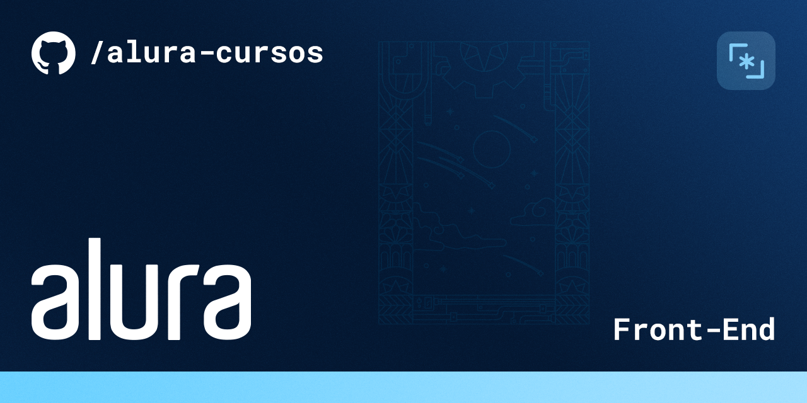

# Portifolio
Meu primeiro portifolio desenvolvido com os cursos de HTML e CSS da Alura

Durante os Cursos fizemos uma pagina onde aplicamos diversos conceitos a respeito de responsividade e tipos de Display.
O Projeto e trabalhado 100% com resposividade sendo compativo com todos os tamanhos de telas.

## 🔨 Funcionalidades do projeto

O projeto trata-se de um site onde aplicamos e aprendemos a respeito das TAGS semanticas fornecidas pelo HMTL5 alem de fazer o design do site ser 100% Responsivo.

## ✔️ Técnicas e tecnologias utilizadas

`HTML` Para realizarmos toda a parte de Identação do documento organizando ele de forma semantica trazendo as melhores tecncicas 

`CSS` Para estilizarmos a pagina e torna-la compativel com diversos dispositivos utilizando os `Media Queries` alem de usarmos algumas opções como o `hover` para algumas animações de interação

## 📁 Acesso ao projeto

  Basta apenas abrir o arquivo `index.html` no seu navegador que tera acesso ao codigo do projeto 

## 🛠️ Abrir e rodar o projeto
https://portifolio-tawny-gamma.vercel.app
